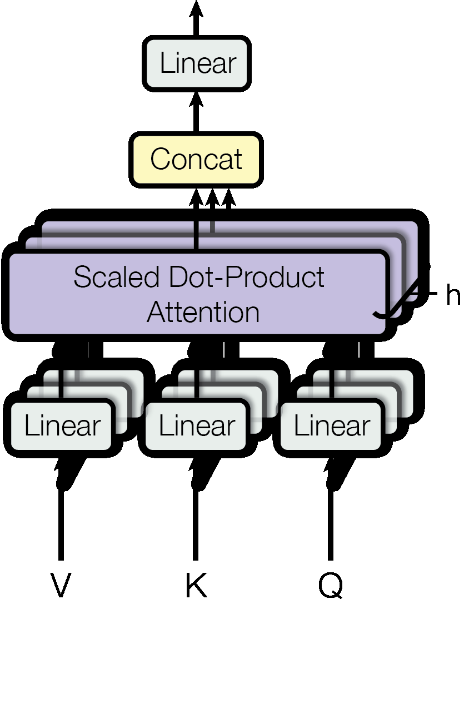

> **🤖 AI Summary Notice**
> 이 글은 AI(Claude)가 논문을 읽고 작성한 요약입니다. 부정확한 내용이 있을 수 있으니, 정확한 정보는 원문을 참고해주세요.

<!--more-->

**저자:** Ashish Vaswani, Noam Shazeer, Niki Parmar, Jakob Uszkoreit, Llion Jones, Aidan N. Gomez, Łukasz Kaiser, Illia Polosukhin  
**발행년도:** 2017  
**링크:** https://arxiv.org/abs/1706.03762

---

## 1. 문제 정의

### 1.1 RNN/LSTM의 순차 계산 병목

2017년 당시 sequence-to-sequence 태스크(기계번역, 언어 모델링 등)의 지배적 아키텍처는 RNN(Recurrent Neural Network)과 LSTM(Long Short-Term Memory), GRU(Gated Recurrent Unit)였다. 이들의 공통된 구조적 특징은 **시간 순서에 따른 은닉 상태 전파**다:

$$h_t = f(h_{t-1}, x_t)$$

이 재귀적 의존성(recurrent dependency)은 근본적인 병렬화 불가 문제를 야기한다. 시퀀스 길이 $n$에 대해 $h_t$를 계산하려면 반드시 $h_{t-1}$이 완료되어야 하므로, **순차 연산 수가 $O(n)$** 이 된다. 이는 현대 GPU의 고도로 병렬화된 SIMD 연산 구조를 전혀 활용하지 못하는 구조다.

구체적으로 배치 크기 $B$, 시퀀스 길이 $n$, 은닉 차원 $d$인 RNN의 전체 연산량은 $O(n \cdot B \cdot d^2)$이며, 이 중 시간 방향 의존성 때문에 $n$ 스텝을 직렬로 실행해야 한다.

### 1.2 장거리 의존성 학습의 어려움

RNN 계열 모델에서 두 위치 $i$와 $j$ 사이의 의존성을 학습하려면 정보가 $|i - j|$개의 스텝을 통과해야 한다. 이 **경로 길이(path length)가 $O(n)$** 이기 때문에, 역전파 시 **기울기 소실(vanishing gradient)** 문제가 발생한다.

ConvS2S(Gehring et al., 2017)와 ByteNet(Kalchbrenner et al., 2016) 같은 CNN 기반 접근은 병렬 처리를 가능하게 했지만, 두 임의 위치 사이의 경로 길이가 $O(\log_k n)$ 또는 $O(n/k)$로 여전히 시퀀스 길이에 의존한다.

---

## 2. 핵심 기여

### 2.1 Recurrence/Convolution의 완전 제거

Transformer의 가장 근본적인 기여는 **시퀀스 변환(sequence transduction)을 오직 어텐션 메커니즘만으로 수행**한다는 것이다. 이로 인해:

- **순차 연산 수**: $O(n)$ → $O(1)$ (레이어당)
- **임의 위치 간 경로 길이**: $O(n)$ → $O(1)$
- **GPU 병렬화**: 시퀀스 전체를 행렬 연산 하나로 처리

### 2.2 Multi-Head Attention 설계

단일 어텐션 대신 **여러 헤드(head)가 서로 다른 표현 부분공간에서 독립적으로 어텐션을 수행**하도록 설계했다. $h=8$개의 헤드와 각 헤드 차원 $d_k = d_v = 64$로 설계되어, 전체 모델 차원 $d_{model} = 512$를 분할한다.

### 2.3 Sinusoidal Positional Encoding

어텐션 자체는 위치 정보를 포함하지 않으므로(permutation-equivariant), 시퀀스 내 위치 정보를 별도로 주입한다. 학습 가능한 임베딩 대신 **정현파(sinusoidal) 함수 기반의 결정론적 인코딩**을 사용하여, 학습 시 보지 못한 더 긴 시퀀스로의 외삽(extrapolation)을 지원한다.

---

## 3. 방법론

### 3.1 전체 아키텍처: Encoder-Decoder 스택

*Figure 1: Transformer 전체 아키텍처. 좌측 인코더(N=6 layers)와 우측 디코더(N=6 layers)로 구성*

**Encoder**:
- $N = 6$개의 동일한 레이어 스택
- 각 레이어: Multi-Head Self-Attention + Position-wise FFN
- 각 서브레이어에 잔차 연결 + 레이어 정규화 적용: $\text{LayerNorm}(x + \text{Sublayer}(x))$
- 출력 차원: $d_{model} = 512$

**Decoder**:
- $N = 6$개의 레이어 스택
- 각 레이어: **Masked** Multi-Head Self-Attention → Multi-Head Cross-Attention → Position-wise FFN
- Masking: 위치 $i > j$인 경우 소프트맥스 입력을 $-\infty$로 마스킹하여 미래 토큰 접근 차단

### 3.2 Scaled Dot-Product Attention

*Figure 3: (좌) Scaled Dot-Product Attention, (우) Multi-Head Attention*

$$\text{Attention}(Q, K, V) = \text{softmax}\!\left(\frac{QK^\top}{\sqrt{d_k}}\right)V$$

- $Q \in \mathbb{R}^{n \times d_k}$: Query 행렬
- $K \in \mathbb{R}^{m \times d_k}$: Key 행렬
- $V \in \mathbb{R}^{m \times d_v}$: Value 행렬

**스케일링의 이유 ($1/\sqrt{d_k}$)**: $d_k$가 커질수록 내적값의 분산이 $d_k$배 증가하여 소프트맥스가 포화 영역에 진입한다. $\sqrt{d_k}$로 나누면 분산을 $O(1)$로 정규화한다.

### 3.3 Multi-Head Attention

$$\text{MultiHead}(Q,K,V) = \text{Concat}(\text{head}_1,...,\text{head}_h)W^O$$
$$\text{where} \quad \text{head}_i = \text{Attention}(QW_i^Q, KW_i^K, VW_i^V)$$

**설계 선택**:
- $h = 8$ heads, $d_k = d_v = d_{model}/h = 64$
- 파라미터 행렬: $W_i^Q, W_i^K \in \mathbb{R}^{d_{model} \times d_k}$, $W_i^V \in \mathbb{R}^{d_{model} \times d_v}$, $W^O \in \mathbb{R}^{hd_v \times d_{model}}$
- 총 계산 비용 ≈ full-dimensional single-head attention

**세 가지 활용**:
1. **Encoder self-attention**: 각 position이 이전 layer의 모든 positions를 attend
2. **Decoder self-attention (masked)**: 현재 및 이전 positions만 attend
3. **Encoder-decoder attention**: Decoder의 각 position이 encoder output 전체를 attend

### 3.4 Position-wise Feed-Forward Networks

$$\text{FFN}(x) = \max(0, xW_1 + b_1)W_2 + b_2$$

- Input/output dimension: $d_{model} = 512$
- Inner dimension: $d_{ff} = 2048$
- Position마다 동일한 파라미터 공유 (1×1 convolution과 동치)

### 3.5 Positional Encoding

$$PE_{(pos, 2i)} = \sin(pos / 10000^{2i/d_{model}})$$
$$PE_{(pos, 2i+1)} = \cos(pos / 10000^{2i/d_{model}})$$

**설계 근거**: $PE_{pos+k}$는 $PE_{pos}$의 linear function으로 표현 가능 → 상대적 위치 학습 용이. 학습 시 보지 못한 더 긴 시퀀스로의 외삽 지원.

### 3.6 Regularization

**Residual Dropout**: 각 sub-layer output + positional encoding sum에 dropout 적용
- Base model: $P_{drop} = 0.1$, Big model: $P_{drop} = 0.3$

**Label Smoothing**: $\epsilon_{ls} = 0.1$
- Perplexity 상승하지만 BLEU 향상 (less confident → better generalization)

---

## 4. 실험 결과

### 4.1 기계 번역 성능

**WMT 2014 English-German** (4.5M sentence pairs, BPE 37K vocab):

| Model | BLEU | Training Cost (FLOPs) |
|-------|------|----------------------|
| GNMT + RL | 24.6 | 2.3×10¹⁹ |
| ConvS2S | 25.16 | 9.6×10¹⁸ |
| MoE | 26.03 | 2.0×10¹⁹ |
| GNMT + RL (ensemble) | 26.30 | 1.8×10²⁰ |
| ConvS2S (ensemble) | 26.36 | 7.7×10¹⁹ |
| **Transformer (base)** | **27.3** | **3.3×10¹⁸** |
| **Transformer (big)** | **28.4** | **2.3×10¹⁹** |

Transformer (big)는 **모든 ensemble 포함 이전 모델 대비 2+ BLEU 초과**, 8 P100 GPUs × 3.5일 학습.

**WMT 2014 English-French** (36M sentences, 32K wordpiece vocab):

| Model | BLEU | Training Cost (FLOPs) |
|-------|------|----------------------|
| Deep-Att + PosUnk (ensemble) | 40.4 | 8.0×10²⁰ |
| ConvS2S (ensemble) | 41.29 | 1.2×10²¹ |
| **Transformer (big)** | **41.8** | **2.3×10¹⁹** |

단일 모델로 ensemble 성능 초과, 기존 SOTA 대비 **약 1/50 FLOPs**.

### 4.2 Ablation Study (Table 3)

WMT En-De newstest2013 dev set 기준:

**(A) Attention heads 수 (h)**:
- h=1: 24.9 BLEU (-0.9), h=4: 25.5, h=8: 25.8 (baseline), h=16: 25.8, h=32 (d_k=16): 25.4

**(B) Key dimension (d_k) 감소**:
- d_k=64→16: BLEU 저하 → key dimensionality가 compatibility 함수 품질에 중요

**(C) Model size 증가**:
- d_model/d_ff 증가 시 consistent improvement, params 90M → 28.4 BLEU

**(D) Dropout**:
- P_drop=0.0: 과적합 발생, 0.1: 25.8 BLEU (최적)

**(E) Positional encoding 방식**:
- Sinusoidal vs Learned: 거의 동일 성능 (25.7 vs 25.8)

### 4.3 English Constituency Parsing

WSJ Penn Treebank (40K training sentences):

| Model | WSJ 23 F1 |
|-------|-----------|
| Dyer et al. (2016) | 91.7 |
| **Transformer (4 layers, WSJ only)** | **91.3** |
| **Transformer (4 layers, semi-supervised)** | **92.7** |

Task-specific tuning 없이 competitive 성능 → generalization 능력 입증.

---

## 5. 계산 복잡도 분석

| Layer Type | Complexity per Layer | Sequential Ops | Max Path Length |
|------------|---------------------|----------------|-----------------|
| Self-Attention | $O(n^2 \cdot d)$ | $O(1)$ | $O(1)$ |
| Recurrent | $O(n \cdot d^2)$ | $O(n)$ | $O(n)$ |
| Convolutional | $O(k \cdot n \cdot d^2)$ | $O(1)$ | $O(\log_k n)$ |
| Self-Attention (restricted, r) | $O(r \cdot n \cdot d)$ | $O(1)$ | $O(n/r)$ |

**Key trade-offs**:
- Self-attention은 $n < d$일 때 Recurrent보다 layer당 연산량 적음 (대부분의 NLP 작업에서 해당)
- $O(n^2)$ attention matrix → 매우 긴 시퀀스에서 메모리 bottleneck (→ FlashAttention 등으로 해결)
- Sequential ops $O(1)$ → 완전한 GPU 병렬화, 학습 throughput 대폭 향상
- Path length $O(1)$ → gradient flow 원활, long-range dependency 학습 효율적

---

## 6. 한계점 및 향후 방향

**Long sequence memory**: $O(n^2)$ attention matrix → 긴 시퀀스에서 메모리 부족. Sparse/local attention (Longformer, BigBird), linear attention approximation (Performer)으로 발전.

**Auto-regressive decoding의 순차성**: Encoder는 완전 병렬이지만 decoder는 여전히 $O(n)$ sequential steps 필요. Non-autoregressive generation 연구로 이어짐.

**비텍스트 모달리티**: 원 논문은 text sequence에 집중. 이후 Vision Transformer (ViT), Audio Transformer 등으로 확장.

**Attention 해석 가능성**: 일부 head가 명확한 linguistic pattern 학습하지만, 전체 메커니즘의 해석은 여전히 연구 중.

---

## 인사이트

**패러다임 전환**: "inductive bias를 최소화하고 data-driven learning에 집중"하는 접근법이 domain-specific bias(recurrence, locality)보다 우월함을 입증. 이후 scaling laws 연구로 이어져 GPT-3, GPT-4, Claude 등 초거대 언어 모델의 기반이 됨.

**Engineering Excellence**:
- Parallelization: O(1) sequential ops → GPU/TPU 활용 극대화
- Scalability: model size, data size 모두에서 consistent improvement
- Simplicity: 복잡한 gating mechanism 없이 attention + FFN만으로 구성

**실무적 교훈**:
- Self-attention의 범용성: sequence뿐 아니라 set/graph 등 다양한 구조에 적용 가능
- Residual connection + Layer Norm: deep network 학습 안정화의 핵심
- Label smoothing: calibration 개선으로 generalization 향상
- Multi-head의 효과: ensemble-like diversification with parameter efficiency

---

## 참고문헌

- [BERT: Pre-training of Deep Bidirectional Transformers](https://arxiv.org/abs/1810.04805) (Devlin et al., 2018)
- [GPT: Improving Language Understanding by Generative Pre-Training](https://cdn.openai.com/research-covers/language-unsupervised/language_understanding_paper.pdf) (Radford et al., 2018)
- [GPT-3: Language Models are Few-Shot Learners](https://arxiv.org/abs/2005.14165) (Brown et al., 2020)
- [ViT: An Image is Worth 16x16 Words](https://arxiv.org/abs/2010.11929) (Dosovitskiy et al., 2020)
- [FlashAttention: Fast and Memory-Efficient Exact Attention](https://arxiv.org/abs/2205.14135) (Dao et al., 2022)
- [Longformer: The Long-Document Transformer](https://arxiv.org/abs/2004.05150) (Beltagy et al., 2020)
