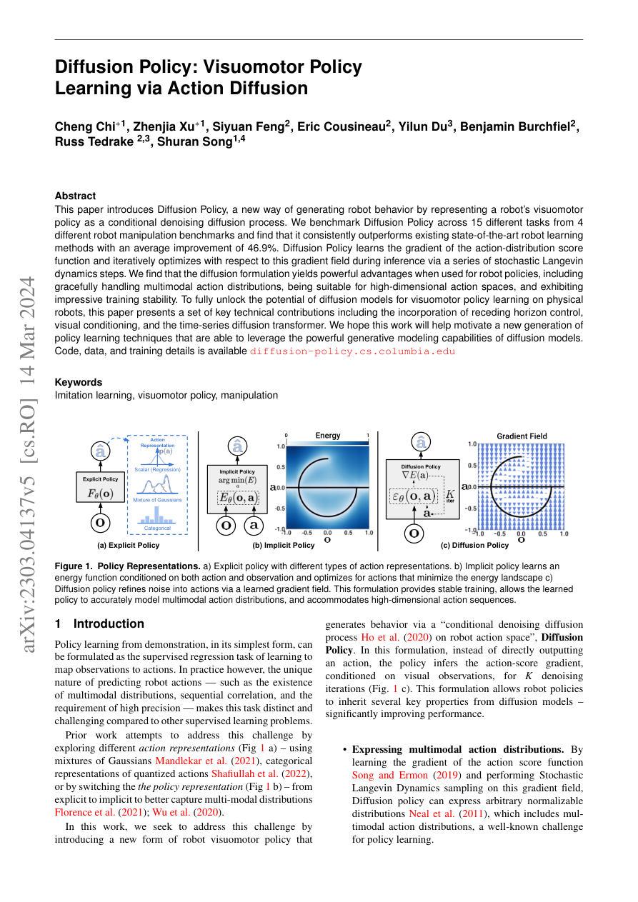
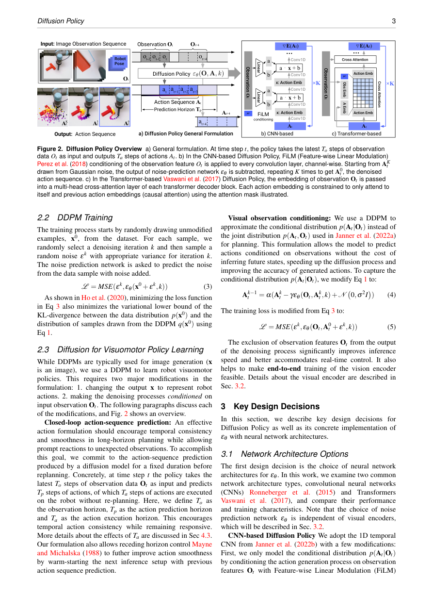
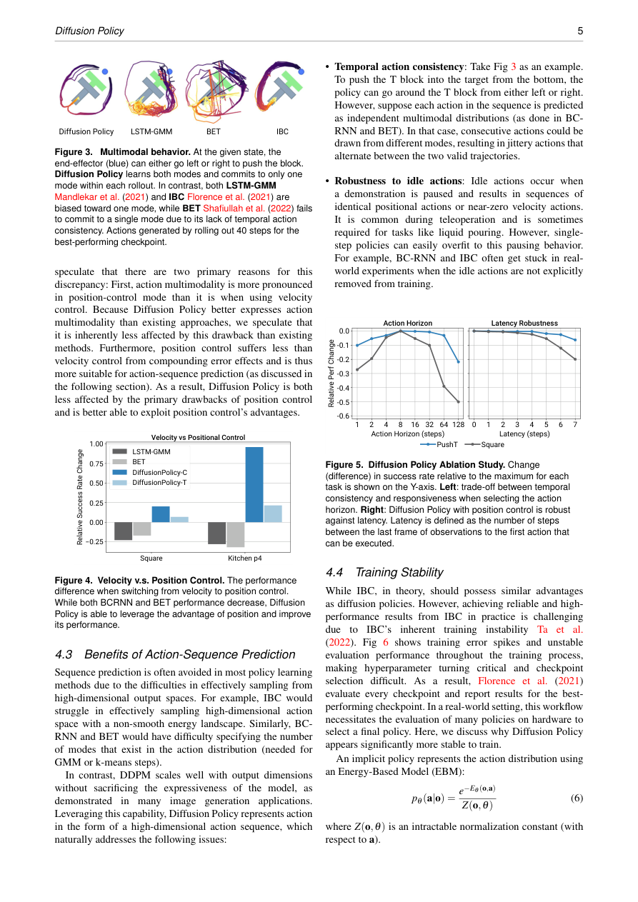
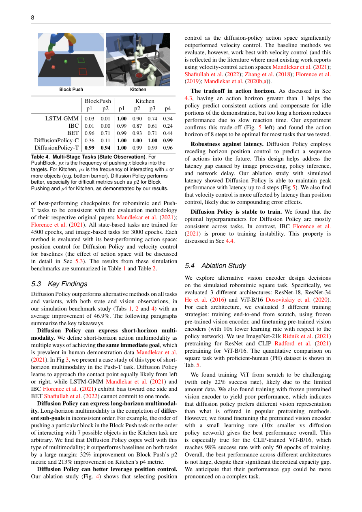
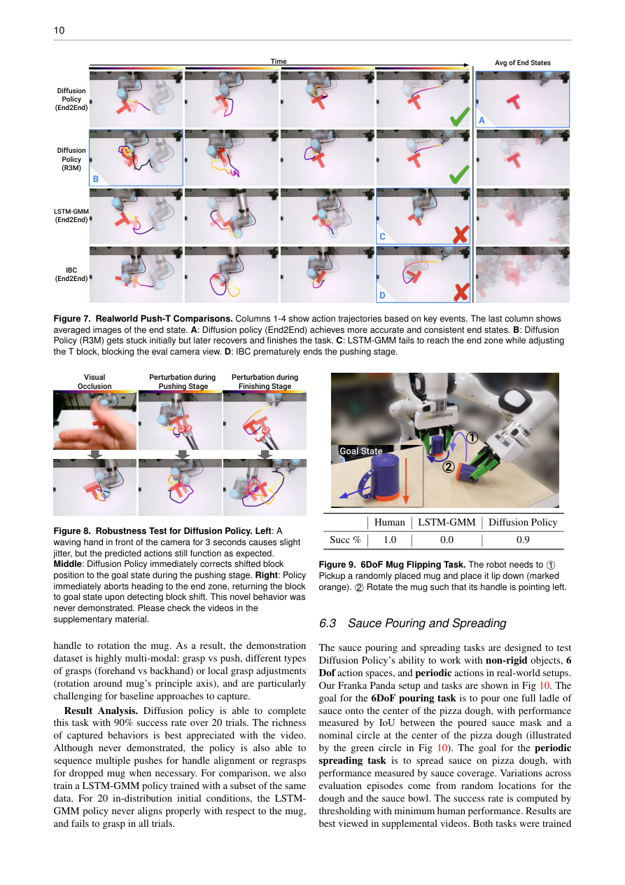
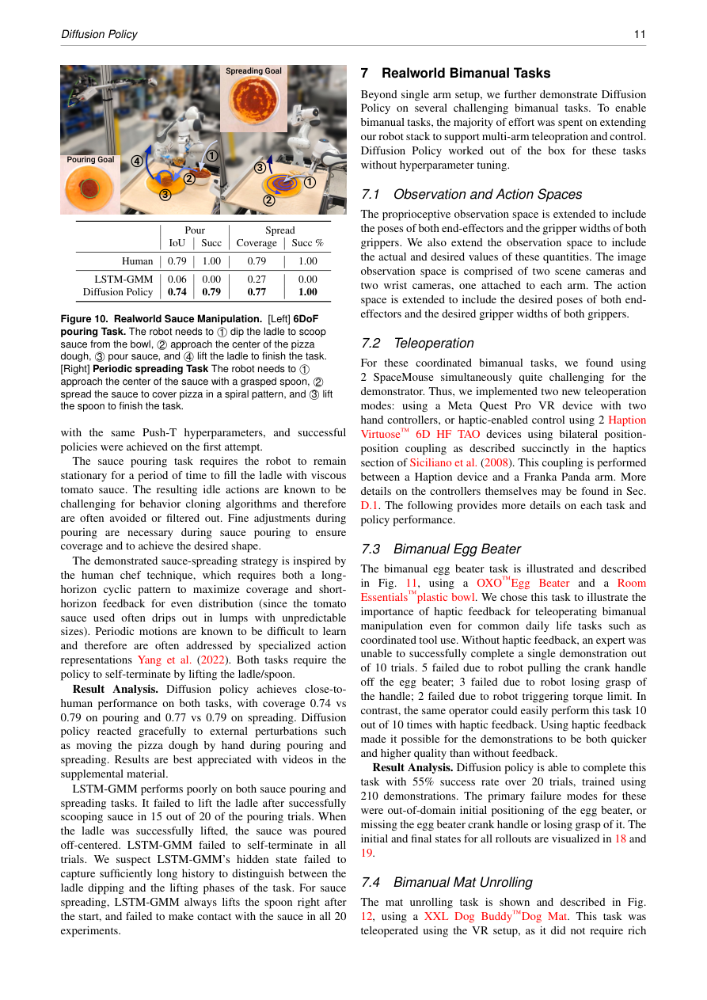
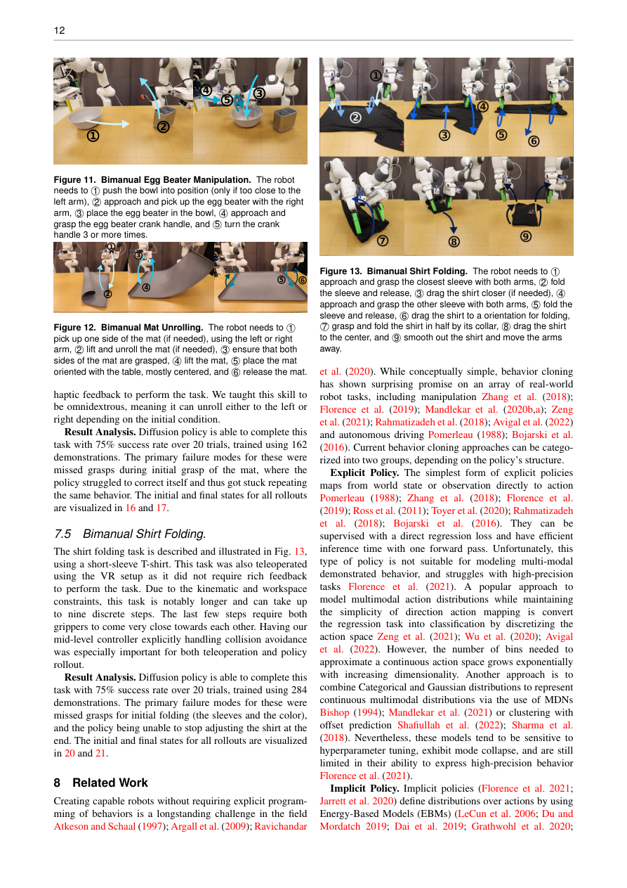

> **🤖 AI Summary Notice**
> 이 글은 AI(Hermes)가 논문을 읽고 작성한 요약입니다. 부정확한 내용이 있을 수 있으니, 정확한 정보는 원문을 참고해주세요.

<!--more-->

**저자:** Cheng Chi, Zhenjia Xu, Siyuan Feng, Eric Cousineau, Yilun Du, Benjamin Burchfiel, Russ Tedrake, Shuran Song  
**발행년도:** 2023  
**링크:** https://arxiv.org/abs/2303.04137

---

## Metadata

- **Paper**: Diffusion Policy: Visuomotor Policy Learning via Action Diffusion
- **Authors**: Cheng Chi, Zhenjia Xu, Siyuan Feng, Eric Cousineau, Yilun Du, Benjamin Burchfiel, Russ Tedrake, Shuran Song
- **arXiv**: [2303.04137](https://arxiv.org/abs/2303.04137)
- **PDF**: [https://arxiv.org/pdf/2303.04137.pdf](https://arxiv.org/pdf/2303.04137.pdf)
- **Study date**: 2026-06-14

## 한 줄 요약

로봇의 visuomotor policy를 observation에서 action으로 직접 회귀하는 모델이 아니라, **observation-conditioned diffusion model로 미래 action sequence를 생성하는 policy**로 만들면, multimodal 행동, 고차원 action, 안정적인 학습, real-world perturbation 대응을 더 잘 처리할 수 있다는 논문이다.

## 핵심 문제의식

기존 Behavior Cloning은 보통 observation에서 action으로 바로 매핑한다.

\[
\pi(a \mid o)
\]

하지만 로봇 manipulation에서는 이 단순한 supervised regression 관점이 자주 깨진다.

- 같은 목표를 달성하는 행동이 여러 개일 수 있다.
  - 예: T-block을 왼쪽에서 밀 수도 있고 오른쪽에서 밀 수도 있음.
  - 예: mug handle을 여러 방식으로 align하거나 grasp할 수 있음.
- action이 한 스텝짜리가 아니라 시간적으로 이어진 sequence여야 한다.
- 고정밀 manipulation에서는 여러 mode의 평균 action이 오히려 실패 행동이 된다.
- demonstration에는 pause, idle action, local adjustment, recovery behavior가 섞여 있다.
- velocity control과 position control 선택에 따라 성능 차이가 크다.

따라서 단순 MSE regression이나 unimodal explicit policy는 multimodal demonstration을 평균내서 이상한 행동을 만들기 쉽다.

위 페이지는 논문이 비교하는 policy representation의 핵심 그림이다. Explicit policy는 action을 직접 출력하고, implicit policy는 energy landscape를 최적화하며, Diffusion Policy는 noise에서 시작해 action을 반복적으로 refine한다.

## 제안: Diffusion Policy

이 논문은 robot policy를 **conditional denoising diffusion process**로 정의한다.

즉, action을 바로 예측하지 않고 noisy action sequence에서 시작해 여러 denoising step을 거쳐 최종 action sequence를 만든다.

논문에서 DDPM update는 대략 다음 형태로 제시된다.

\[
x_{k-1} = \alpha(x_k - \gamma \epsilon_\theta(x_k, k) + \mathcal{N}(0, \sigma^2 I))
\]

여기서 \(\epsilon_\theta\)는 noise prediction network이며, action distribution의 score 또는 gradient field를 학습하는 것으로 해석할 수 있다.

다른 말로 하면 Diffusion Policy는 다음 질문을 학습한다.

> 이 observation에서 좋은 action sequence가 위치한 방향은 어디인가?

그리고 inference 때 stochastic denoising / Langevin dynamics style의 반복 업데이트를 통해 action sample을 좋은 행동 쪽으로 점점 이동시킨다.

## 왜 diffusion이 robot policy에 좋은가?

### 1. Multimodal action distribution 표현

로봇 demonstration은 자연스럽게 multimodal이다. 같은 목표에 도달하는 여러 valid trajectory가 있기 때문이다.

Diffusion Policy는 sampling 기반이므로 여러 mode 중 하나를 선택할 수 있다. 논문에서는 Push-T task에서 end-effector가 T-block을 왼쪽 또는 오른쪽에서 접근하는 서로 다른 mode를 자연스럽게 표현하는 예시를 보여준다.

### 2. High-dimensional action sequence 생성

Diffusion Policy는 단일 action이 아니라 미래 action sequence를 예측한다.

\[
A_t = [a_t, a_{t+1}, \ldots, a_{t+T_p}]
\]

이 방식은 다음 장점이 있다.

- temporal consistency가 좋아진다.
- 행동이 덜 흔들린다.
- pause 또는 idle section이 있는 demonstration을 더 잘 다룬다.
- 단기 반응성과 장기 계획 사이의 균형을 잡을 수 있다.

### 3. EBM/implicit policy보다 안정적인 학습

Implicit Behavioral Cloning, IBC류는 energy function을 학습한 뒤 action을 energy minimization으로 찾는다. 하지만 EBM 계열은 normalization constant나 negative sampling 문제 때문에 학습이 불안정해질 수 있다.

Diffusion Policy는 energy 자체가 아니라 score/gradient를 학습하기 때문에 이 문제를 우회한다. 논문에서는 IBC가 학습 중 evaluation success가 크게 흔들리는 반면, Diffusion Policy는 더 안정적으로 train된다고 보고한다.

## 주요 설계 요소

### 1. Receding Horizon Control

Diffusion Policy는 미래 action sequence 전체를 예측하지만, 전부 실행하지 않는다.

- prediction horizon: \(T_p\)
- action execution horizon: \(T_a\)
- observation horizon: \(T_o\)

예측된 action sequence 중 일부만 실행하고, 다음 observation을 보고 다시 action sequence를 생성한다. 이는 MPC와 유사한 receding horizon 구조다.

장점:

- action sequence 덕분에 부드럽고 일관된 행동을 만들 수 있다.
- 매번 observation을 보고 replan하므로 closed-loop 대응이 가능하다.
- latency나 perturbation에 더 강하다.

논문은 action horizon이 너무 짧으면 temporal consistency가 부족하고, 너무 길면 반응성이 떨어진다고 분석한다. 실험적으로 많은 task에서 action horizon 8 step이 좋은 default로 관찰되었다.

### 2. Visual Conditioning

이미지를 diffusion state의 일부로 직접 넣는 대신, visual encoder로 feature를 추출하고 이를 condition으로 사용한다.

이 설계가 중요한 이유는 denoising step마다 이미지를 다시 encode하면 inference가 너무 느려지기 때문이다. visual representation을 한 번 뽑고, action denoising network에 condition으로 넣으면 real-time policy에 가까워질 수 있다.

### 3. CNN-based Diffusion Policy와 Transformer-based Diffusion Policy

논문은 두 가지 diffusion backbone을 비교한다.

#### CNN-based Diffusion Policy

- 1D temporal CNN 기반
- 대부분 task에서 안정적
- hyperparameter tuning이 상대적으로 쉬움
- 논문은 새로운 task에서는 CNN-based Diffusion Policy부터 시작하는 것을 권장한다.

#### Transformer-based Diffusion Policy

- time-series diffusion transformer
- observation embedding에 cross-attention
- 고주파 action 변화나 복잡한 task에서 더 강할 수 있음
- 하지만 학습이 더 까다로울 수 있음

정리하면, CNN은 안정적인 기본값이고 Transformer는 복잡도가 높거나 action 변화가 빠른 task에서 성능 개선 가능성이 있다.

## Intriguing Properties

논문은 Diffusion Policy의 흥미로운 특성을 별도로 분석한다.

### Multimodality

Diffusion Policy의 multimodality는 두 곳에서 나온다.

1. stochastic initialization
2. denoising 과정에서의 stochastic sampling

이 덕분에 같은 observation에서도 여러 valid action mode를 표현할 수 있다.

### Position control과 action sequence prediction

논문은 Diffusion Policy에서 position control이 velocity control보다 더 잘 맞는다고 보고한다. 특히 action sequence를 예측하는 구조에서는 position target을 sequence로 생성하는 것이 누적 오류와 latency에 더 robust한 것으로 보인다.

### 안정성

Diffusion Policy는 IBC처럼 intractable normalization constant를 직접 다루지 않는다. 따라서 EBM 기반 implicit policy보다 학습이 안정적이고 checkpoint selection도 덜 민감하다.

## 실험 구성

논문은 simulation과 real-world를 합쳐 총 15개 task에서 평가한다.

주요 benchmark와 task:

- Robomimic
  - Lift
  - Can
  - Square
  - Transport
  - ToolHang
- Push-T
- BlockPush
- Franka Kitchen
- Real-world Push-T
- Mug Flipping
- Sauce Pouring
- Sauce Spreading
- Bimanual Egg Beater
- Bimanual Mat Unrolling
- Bimanual Shirt Folding

비교 baseline:

- LSTM-GMM / BC-RNN
- IBC
- BET
- task-specific baseline variants

논문은 state observation과 visual observation 모두에서 Diffusion Policy를 평가한다.

## 주요 결과

핵심 수치:

> Diffusion Policy는 전체 benchmark에서 기존 SOTA 대비 평균 **46.9% success-rate improvement**를 보였다.

특히 복잡한 task에서 차이가 크다.

### Robomimic / visual policy

Transport, ToolHang처럼 복잡하고 고정밀 동작이 필요한 task에서 LSTM-GMM이나 IBC보다 Diffusion Policy가 강한 성능을 보인다.

### BlockPush / Kitchen

이 두 task는 long-horizon multimodality가 중요하다.

- BlockPush: 어떤 block을 먼저 어느 target으로 밀지
- Kitchen: 여러 object를 어떤 순서로 조작할지

논문은 Diffusion Policy가 이러한 long-horizon multimodality에 강하며, BlockPush의 p2 metric과 Kitchen의 p4 metric에서 큰 개선을 보인다고 설명한다.

## Real-world 결과

### Real-world Push-T

Real-world Push-T는 simulation보다 더 어렵다.

- T-block을 target region에 넣어야 함
- 이후 end-effector를 end-zone으로 이동해야 함
- fine adjustment가 필요함
- IoU를 마지막 state에서 측정함

결과:

- Human IoU: 0.84
- Diffusion Policy IoU: 0.80
- Diffusion Policy success: 95%

baseline은 훨씬 낮은 success를 보인다.

논문은 visual occlusion, pushing-stage perturbation, finishing-stage perturbation도 테스트한다. 흥미로운 점은 demonstration에 명시적으로 없던 상황에서도 Diffusion Policy가 block이 밀리면 다시 돌아와서 수정하는 행동을 보였다는 것이다.

### Mug Flipping

6DoF mug flipping task에서 Diffusion Policy는 20 trials 기준 90% success를 달성한다. LSTM-GMM은 mug를 제대로 align하거나 grasp하지 못하고 실패했다고 보고된다.

### Sauce Pouring / Spreading

비정형 물체, 유체, 주기적 행동이 들어간 task다.

| Task | Human | LSTM-GMM | Diffusion Policy |
|---|---:|---:|---:|
| Pouring IoU | 0.79 | 0.06 | 0.74 |
| Pouring success | 1.00 | 0.00 | 0.79 |
| Spreading coverage | 0.79 | 0.27 | 0.77 |
| Spreading success | 1.00 | 0.00 | 1.00 |

Diffusion Policy가 human에 가까운 성능을 보인다.

### Bimanual tasks

논문은 양팔 manipulation task도 보여준다.

- Egg Beater: 55% success, 210 demonstrations
- Mat Unrolling: 75% success, 162 demonstrations
- Shirt Folding: 75% success, 284 demonstrations

여기서 중요한 점은 Diffusion Policy 자체가 큰 hyperparameter tuning 없이 bimanual tasks에 적용되었다는 것이다. 대부분의 추가 노력은 policy architecture보다는 teleoperation/control stack 확장에 있었다.

## Ablation 및 실용적 takeaway

### 1. Position control이 중요하다

Diffusion Policy는 position control action space와 잘 맞았다. baseline들은 velocity control에서 더 잘 작동하는 경우가 많았지만, Diffusion Policy는 receding horizon sequence prediction과 position target이 잘 결합되었다.

### 2. Action horizon에는 trade-off가 있다

- 너무 짧음: temporal consistency 부족
- 너무 김: 반응성이 낮아짐

논문은 많은 task에서 action horizon 8 step 근처가 좋았다고 보고한다.

### 3. Latency에 강하다

Receding horizon position control 덕분에 image processing, policy inference, network delay로 인한 latency에 어느 정도 강하다. 논문은 simulated latency가 4 step까지 있어도 peak performance를 유지했다고 보고한다.

### 4. Vision encoder pretraining은 조심해야 한다

Robomimic Square task에서 vision encoder를 비교한다.

- ResNet18 / ResNet34 / ViT-B
- scratch
- frozen pretrained
- finetuning pretrained

결론:

- frozen pretrained encoder는 성능이 좋지 않았다.
- pretrained encoder를 낮은 learning rate로 finetuning하는 것은 좋았다.
- ViT-B/CLIP finetuning은 빠르게 높은 성능에 도달했다.
- 하지만 real-world Push-T에서는 end-to-end training이 가장 효과적이었다.

즉, pretrained visual representation을 그냥 얼려서 쓰면 충분하지 않고, task-specific finetuning 또는 end-to-end training이 중요하다.

## 한계

### 1. Behavior Cloning의 한계를 그대로 가진다

Diffusion Policy도 결국 expert demonstration에서 학습한다. 따라서 demonstration이 부족하거나 suboptimal하면 성능이 제한된다.

논문은 future work로 RL, suboptimal data, negative data를 활용하는 방향을 언급한다.

### 2. Inference cost / latency가 크다

Diffusion은 여러 denoising step을 거치므로 LSTM-GMM 같은 단순 policy보다 inference cost가 크다.

Action sequence prediction이 이를 완화하지만, high-rate control이 필요한 task에서는 여전히 문제가 될 수 있다. 논문은 future work로 diffusion acceleration, better noise schedule, fast solver, consistency model 등을 언급한다.

## 내 해석

이 논문의 핵심은 단순히 “diffusion model을 로봇에 가져왔다”가 아니다.

진짜 메시지는 다음에 가깝다.

> Behavior Cloning에서 policy representation 자체가 bottleneck이다.

데이터가 좋아도 policy가 unimodal regression이면 복잡한 manipulation을 잘 표현하지 못한다. Diffusion Policy는 action distribution을 더 풍부하게 표현하고, action sequence를 생성하며, receding horizon으로 closed-loop 제어를 수행하기 때문에 기존 BC보다 강하다.

특히 이 논문은 robot imitation learning에서 다음 조합의 중요성을 보여준다.

1. Action sequence prediction
2. Receding horizon execution
3. Position control
4. Conditional visual diffusion
5. Multimodal action sampling
6. Stable training without EBM negative sampling

## 짧은 결론

Diffusion Policy는 robot action을 image처럼 생성 대상으로 본다. observation을 condition으로 주고 action sequence를 denoising으로 생성한다.

이때 receding horizon control과 position action space를 결합하면 simulation뿐 아니라 실제 로봇에서도 강하게 작동한다.

## Q&A Log

### Q. 이 논문을 스레드에서 다시 설명해줘.

A. Diffusion Policy는 action을 직접 회귀하지 않고, observation-conditioned diffusion model로 미래 action sequence를 생성하는 robot policy다. Multimodal demonstration, high-dimensional action, long-horizon manipulation, real-world perturbation에서 기존 BC 계열보다 강하며, 논문은 15개 task에서 평균 46.9% success-rate improvement를 보고한다.

### Q. 이거 Obsidian에 작성해줘.

A. 본 노트로 정리함.

## References

- [arXiv:2303.04137](https://arxiv.org/abs/2303.04137)
- [Project page](https://diffusion-policy.cs.columbia.edu/)