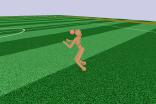

> **🤖 AI Summary Notice**
> 이 글은 AI가 논문을 읽고 작성한 요약입니다. 부정확한 내용이 있을 수 있으니, 정확한 정보는 원문을 참고해주세요.

<!--more-->

**저자:** John Schulman, Filip Wolski, Prafulla Dhariwal, Alec Radford, Oleg Klimov  
**발행년도:** 2017  
**링크:** https://arxiv.org/abs/1707.06347

---

## 문제 정의
정책경사(Policy Gradient) 계열은 (1) 데이터 효율/안정성이 떨어지거나(바닐라 PG), (2) 안정성은 좋지만 구현과 제약이 복잡(TRPO)하다는 trade-off가 있다.

- **바닐라 PG**: 동일한 샘플로 여러 번 업데이트하면 policy shift가 커져 성능이 무너질 수 있음.
- **TRPO**: surrogate objective를 **KL 제약** 하에서 최적화하여 안정성을 확보하지만, 2차 근사/CG/라인서치 등 구현이 복잡.

PPO는 **TRPO의 안정성에 가까운 업데이트**를, **1차 최적화(Adam + minibatch)** 만으로 쉽게 구현하는 것을 목표로 한다.

---

## 핵심 기여
- **Clipped Surrogate Objective**로 큰 정책 업데이트를 억제하면서도, 동일한 배치로 **여러 epoch 업데이트**를 가능하게 함.
- 다양한 벤치마크에서 **샘플 효율·단순성·벽시계시간** 균형이 좋음을 보임.

---

## 방법론

### (A) TRPO 스타일 ratio surrogate
\(r_t(\theta)=\pi_\theta(a_t\mid s_t)/\pi_{\theta_{old}}(a_t\mid s_t)\) 로 두면, CPI surrogate:
\[
L^{CPI}(\theta)=\mathbb{E}_t[r_t(\theta)\hat A_t]
\]

### (B) PPO clipped objective
\[
L^{CLIP}(\theta)=\mathbb{E}_t[\min(r_t(\theta)\hat A_t,\;\mathrm{clip}(r_t(\theta),1-\epsilon,1+\epsilon)\hat A_t)]
\]

<em>Figure 1. advantage 부호에 따라 확률비 r를 [1-ε, 1+ε] 범위로 clipping하여 surrogate term을 보수적으로 제한.</em>

<em>Figure 2. 업데이트 방향으로 보간할 때 surrogate 및 KL의 변화를 비교. L^CLIP이 L^CPI에 대한 보수적 하한처럼 동작.</em>

### (C) Actor-Critic 결합 (Value/Entropy)
\[
L(\theta)=\mathbb{E}_t[L^{CLIP}_t(\theta) - c_1 L^{VF}_t(\theta) + c_2 S[\pi_\theta](s_t)]
\]

Advantage는 TD residual과 (truncated) GAE로 계산:
\[
\delta_t=r_t+\gamma V(s_{t+1})-V(s_t),\quad
\hat A_t=\delta_t+(\gamma\lambda)\delta_{t+1}+\cdots
\]

학습은 N actor × T steps rollout으로 NT 샘플을 모은 뒤, 같은 배치로 K epochs 동안 minibatch(크기 M) Adam/SGD.

---

## 실험 결과

<em>Figure 3. 여러 MuJoCo 환경에서 알고리즘 비교. PPO가 전반적으로 강한 성능/안정성.</em>

<em>Figure 4. Roboschool humanoid 3D 과제에서 PPO 학습 곡선.</em>

<em>Figure 5. 학습된 정책의 스틸 프레임(qualitative).</em>

<em>Figure 6. Atari 49개 게임에서 PPO와 A2C 비교(샘플 효율 관점).</em>

---

## 계산/구현 포인트
- TRPO 대비: 2차 근사/CG/라인서치 없이 **일반적인 딥러닝 학습 루프**로 구현 가능.
- 안정성은 주로 \(\epsilon\), epoch 수 K, minibatch 크기 M, 그리고 advantage 추정(\(\gamma,\lambda\))에 민감.
- 실무에서는 KL 모니터링(또는 KL 기반 early stop)을 추가하면 안정화에 도움이 된다.

---

## 한계 / 주의점
- clipping이 trust region을 완벽 대체하는 것은 아니며, \(\epsilon\) 및 data reuse(K)가 과하면 여전히 불안정 가능.
- on-policy 특성상 환경 상호작용 비용이 큰 문제에서는 샘플 효율 한계가 존재.

---

## 인사이트
- PPO는 “고정된 배치로 여러 번 학습하고 싶은” 엔지니어링 요구를, TRPO의 아이디어를 유지하면서도 매우 단순한 형태로 풀어낸 해법.
- ratio clipping은 gradient 신호를 특정 구간에서 잘라내 업데이트 폭을 제한하는 강력한 규제(reg.)로 동작.

---

## References
- PPO: https://arxiv.org/abs/1707.06347
- TRPO: https://arxiv.org/abs/1502.05477
- GAE: https://arxiv.org/abs/1506.02438
- A3C: https://arxiv.org/abs/1602.01783
- ACER: https://arxiv.org/abs/1611.01224
- DQN: https://www.nature.com/articles/nature14236
