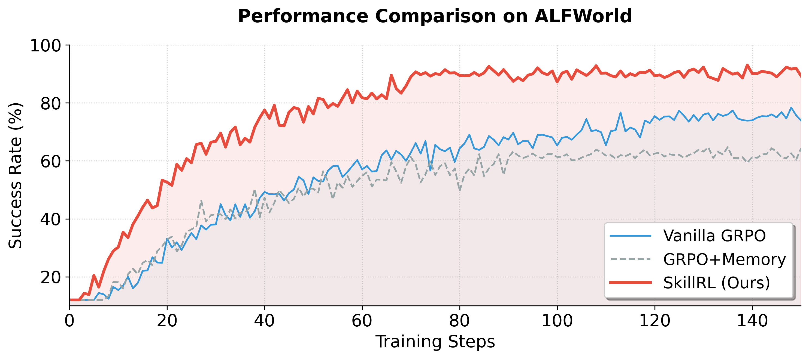
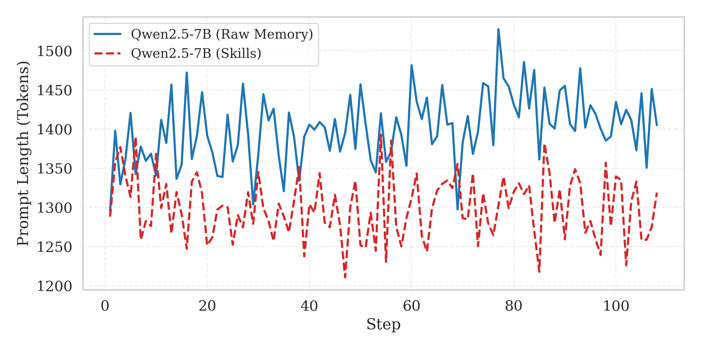
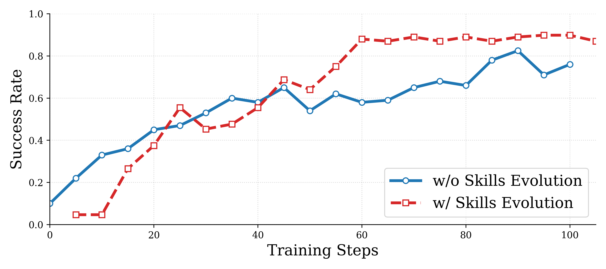

> **🤖 AI Summary Notice**
> 이 글은 AI(Claude)가 논문을 읽고 작성한 요약입니다. 부정확한 내용이 있을 수 있으니, 정확한 정보는 원문을 참고해주세요.

<!--more-->

**저자:** Peng Xia, Jianwen Chen, Hanyang Wang, Jiaqi Liu, Kaide Zeng, Yu Wang, Siwei Han, Yiyang Zhou, Xujiang Zhao, Haifeng Chen, Zeyu Zheng, Cihang Xie, Huaxiu Yao  
**발행년도:** 2026 (Preprint)  
**링크:** https://arxiv.org/abs/2602.08234

---

## 1. 문제 정의

### 1.1 LLM 에이전트의 경험 고립 문제

LLM 기반 에이전트는 웹 내비게이션, deep research 등 복잡한 태스크에서 놀라운 성능을 보이지만, 각 태스크 실행이 **독립적 에피소드**로 이루어진다는 근본 한계가 있다. 이전 성공이나 실패로부터 학습하지 못하고 매번 처음부터 시작한다.

기존 **메모리 기반 방법들**의 두 가지 치명적 문제:

- **중복성과 노이즈**: 원시 궤적(raw trajectory)은 탐색적 행동, 백트래킹, 불필요한 단계들로 가득 차 있어 핵심 정보 추출이 어렵다
- **정책 미개선**: 과거 해결책을 모방할 뿐, 에이전트의 내부 정책을 근본적으로 개선하지 못한다. MemRL처럼 메모리 업데이트에만 RL을 쓰고 정책을 고정하면 ALFWorld 21.4%라는 저조한 성능에 그친다

### 1.2 핵심 통찰: 추상화가 필요하다

인간 전문가는 모든 상황의 모든 행동을 암기하지 않는다. 대신 **스킬** — 특정 서브태스크 수행 방법의 핵심을 담은 컴팩트하고 재사용 가능한 전략 — 을 개발한다. SkillRL은 이 통찰을 LLM 에이전트 학습에 적용한다.

---

## 2. 핵심 기여

- **Experience-based Skill Distillation**: 원시 궤적 → 컴팩트한 스킬 (10–20× 토큰 압축)
- **계층적 스킬 라이브러리 SKILLBANK**: General Skills + Task-Specific Skills 두 레벨 구조
- **Recursive Skill Evolution**: RL 학습 중 스킬 라이브러리와 에이전트 정책이 **공동 진화(co-evolve)**

---

## 3. 방법론

### 3.1 전체 프레임워크

```
Base Model → 환경 롤아웃 → 성공/실패 궤적 수집
     ↓
Teacher Model(o3)로 스킬 증류 → SKILLBANK 구축
     ↓
Cold-start SFT (스킬 활용법 학습)
     ↓
GRPO 기반 RL 학습 + Recursive Skill Evolution (validation마다)
```

### 3.2 Experience-based Skill Distillation

기존 방법들과 달리 **성공 궤적과 실패 궤적을 모두** 활용한다.

**성공 궤적** $T^+ = \{\tau_i : r(\tau_i) = 1\}$ → 전략적 패턴 추출:

$$s^+ = M_T(\tau^+, d)$$

**실패 궤적** $T^- = \{\tau_i : r(\tau_i) = 0\}$ → 간결한 실패 교훈으로 합성:

$$s^- = M_T(\tau^-, d)$$

분석: (1) 실패 지점, (2) 잘못된 추론/행동, (3) 올바른 대안, (4) 유사 실패 방지 원칙. 장황한 실패 에피소드를 **반사실적 지식(counterfactual)**으로 변환.

> 스킬 증류로 **10–20× 토큰 압축** 달성하면서 경험의 유용성은 오히려 향상

### 3.3 계층적 스킬 라이브러리 SKILLBANK

$$\text{SKILLBANK} = S_g \cup \bigcup_{k=1}^{K} S_k$$

**General Skills $S_g$** — 모든 태스크에 적용 가능한 범용 전략 (탐색 전략, 상태 관리 원칙, 목표 추적 휴리스틱 등)

**Task-Specific Skills $S_k$** — 카테고리 $k$ 특화 도메인 지식 (도메인 특화 행동 시퀀스, 공통 실패 모드 등)

**스킬 검색 (추론 시)**:

$$S_{ret} = \text{TopK}(\{s \in S_k : \text{sim}(e_d, e_s) > \delta\}, K)$$

$K=6$, $\delta=0.4$. 일반 스킬은 항상 포함. 정책 조건화:

$$a_t \sim \pi_\theta(a_t | o_{\leq t}, d, S_g, S_{ret})$$

### 3.4 Cold-Start SFT

RL 전 필수 단계. Teacher model $M_T$가 스킬 증강 추론 트레이스 $D_{SFT}$ 생성 후 fine-tuning:

$$\theta_{sft} = \arg\min_\theta \mathcal{L}_{CE}(D_{SFT}; \theta)$$

결과 모델 $\pi_{\theta_{sft}}$가 RL 시작점 + KL 정규화용 reference policy $\pi_{ref}$.

### 3.5 GRPO 기반 RL 최적화

각 태스크 $d$에 대해 $G$개 궤적 샘플링, 이진 보상 $R_i \in \{0,1\}$. Normalized advantage:

$$A_i = \frac{R_i - \text{mean}(\{R_j\}_{j=1}^G)}{\text{std}(\{R_j\}_{j=1}^G)}$$

정책 업데이트 (importance ratio $\rho_i = \frac{\pi_\theta(\tau^{(i)} | d, S_g, S_{ret})}{\pi_{old}(\tau^{(i)} | d, S_g, S_{ret})}$):

$$J(\theta) = \mathbb{E}\!\left[\frac{1}{G}\sum_{i=1}^G \min\!\left(\rho_i A_i,\, \text{clip}(\rho_i, 1{-}\epsilon, 1{+}\epsilon)A_i\right) - \beta D_{KL}(\pi_\theta \| \pi_{ref})\right]$$

### 3.6 Recursive Skill Evolution

각 validation epoch 이후, $\text{Acc}(C) < \delta$ 인 카테고리에만 진화 트리거:

$$S_{new} = M_T(T_{val}^-, \text{SKILLBANK})$$

업데이트: $\text{SKILLBANK} \leftarrow \text{SKILLBANK} \cup S_{new}$

**선순환**: 정책 개선 → 새 도전 발견 → 스킬 라이브러리 확장 → 더 많은 개선

---

## 4. 실험 결과

### 4.1 메인 결과

<p align="center"></p>

*ALFWorld 검증 세트 성능. SkillRL(빨간선)이 ~90%로 Vanilla GRPO(~77%)와 GRPO+Memory(~62%)를 크게 앞선다*

**ALFWorld 및 WebShop** (base: Qwen2.5-7B-Instruct):

| Method | ALFWorld (All) | WebShop (Succ.) |
|--------|:--------------:|:---------------:|
| GPT-4o | 48.0% | 23.7% |
| Gemini-2.5-Pro | 60.3% | 35.9% |
| GRPO | 77.6% | 66.1% |
| Mem0+GRPO | 54.7% | 37.5% |
| SimpleMem+GRPO | 62.5% | 46.9% |
| **SkillRL** | **89.9%** | **72.7%** |

- GRPO 대비 **+12.3%** — 순수 스킬 증강의 효과
- GPT-4o 대비 **+41.9%**, Gemini-2.5-Pro 대비 **+29.6%** — 7B 오픈소스가 클로즈드소스 압도
- Cool +23.0%, Pick2 +22.8% — 다단계 계획 태스크에서 특히 효과적

**Search-Augmented QA (7개 벤치마크)**:
- SkillRL 평균 **47.1%** vs EvolveR 43.1% vs Search-R1 38.5%
- Bamboogle(multi-hop): **73.8%** — EvolveR 대비 +19.4%

### 4.2 Ablation Study

| Method | ALFWorld | WebShop |
|--------|:--------:|:-------:|
| SkillRL (full) | 89.9% | 72.7% |
| w/o Hierarchical Structure | 76.8% (−13.1%) | 61.4% (−11.3%) |
| w/o Skill Library (Raw Traj.) | 61.7% (**−25.2%**) | 50.2% (−22.5%) |
| w/o Cold-Start SFT | 65.2% (**−24.7%**) | 46.5% (−26.2%) |
| w/o Dynamic Evolution | 84.4% (−5.5%) | 70.3% (−2.4%) |

### 4.3 컨텍스트 효율성

<p align="center"></p>

*Prompt 길이 비교. SkillRL이 Raw Memory 대비 평균 ~10.3% 적은 토큰 사용 (~1,300 vs ~1,450 tokens)*

### 4.4 스킬 진화 효과

<p align="center"></p>

*재귀적 스킬 진화 효과. 진화 포함 시 60 스텝 내 80% 도달, 미포함 시 90 스텝 필요하고 최고 성능도 낮음*

스킬 라이브러리 성장: 초기 **55개** (일반 12, 태스크 특화 43) → 학습 완료 **100개** (일반 20, 태스크 특화 80)

---

## 5. 계산 복잡도 분석

- **스킬 증류**: 원시 궤적 대비 10–20× 토큰 압축
- **스킬 검색**: 추론 시 시맨틱 유사도 $K=6$ — 추가 레이턴시 미미
- **학습 설정**: Qwen2.5-7B-Instruct (base), OpenAI o3 (teacher), LR 1×10⁻⁶, batch 16, group size 8
- **컨텍스트 효율**: ~1,300 tokens (Raw Memory ~1,450 대비 10.3% 절감)

---

## 6. 한계점 및 향후 방향

- **Teacher Model 의존성**: 강력한 teacher(OpenAI o3) 필요 → 접근성 제한, 비용 발생
- **이진 보상 한계**: Dense/partial reward 활용 시 학습 효율 개선 가능
- **스킬 라이브러리 확장성**: 태스크 복잡도 증가 시 스킬 통합/가지치기 전략 필요
- **멀티모달 확장**: 현재 텍스트 기반 환경 국한 → Vision-language 에이전트 확장 필요

---

## 인사이트

**추상화 vs 암기의 승리**: Raw trajectory 저장보다 스킬 추상화가 최대 25% 더 높은 성능. "경험 전달에는 추상화가 필요하다"는 주장을 수치로 입증.

**실패에서의 학습**: 성공 궤적만 아니라 실패를 counterfactual 지식으로 변환하는 발상이 핵심 혁신. 기존 memory 방법들이 간과했던 정보원.

**공동 진화**: 정적 지식 베이스가 아닌 에이전트 정책과 스킬 라이브러리가 함께 진화해야 robust한 성능 달성. 인간 학습 방식과 유사.

**모델 스케일 vs 구조적 학습**: 7B 오픈소스가 GPT-4o를 +41.9% 앞서는 결과 — 적절한 경험 활용 구조가 단순한 모델 크기보다 더 중요할 수 있음을 시사.

---

## 참고문헌

- [ReAct: Synergizing Reasoning and Acting in Language Models](https://arxiv.org/abs/2210.03629) (Yao et al., 2022)
- [Reflexion: Language Agents with Verbal Reinforcement Learning](https://arxiv.org/abs/2303.11366) (Shinn et al., 2023)
- [ExpeL: LLM Agents Are Experiential Learners](https://arxiv.org/abs/2308.10144) (Zhao et al., 2024)
- [DeepSeekMath (GRPO)](https://arxiv.org/abs/2402.03300) (Shao et al., 2024)
- [EvolveR: Self-Evolving LLM Agents](https://arxiv.org/abs/2510.16079) (Wu et al., 2025)
- [MemRL: Self-Evolving Agents via Runtime RL on Episodic Memory](https://arxiv.org/abs/2601.03192) (Zhang et al., 2026)
