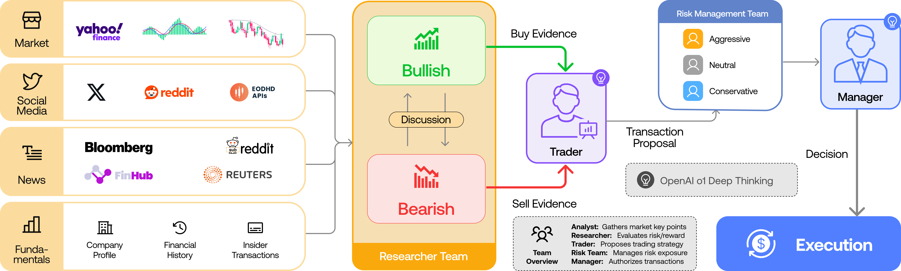

> **🤖 AI Summary Notice**
> 이 글은 AI(Hermes)가 논문을 읽고 작성한 요약입니다. 부정확한 내용이 있을 수 있으니, 정확한 정보는 원문을 참고해주세요.

<!--more-->

**저자:** Yijia Xiao, Edward Sun, Di Luo, Wei Wang  
**발행년도:** 2024  
**링크:** https://arxiv.org/abs/2412.20138

---

## 한줄 요약
실제 트레이딩 회사처럼 역할이 분화된 여러 LLM 에이전트가 협업, 토론, 리스크 검토를 거쳐 매매 결정을 내리게 하면, 단순 규칙 기반 전략보다 더 높은 수익성과 더 나은 위험조정 성과를 낼 수 있다는 것을 보이려는 논문이다.

## 문제 정의
이 논문은 기존 금융용 LLM 에이전트 시스템의 두 가지 핵심 한계를 지적한다.

1. 실제 트레이딩 조직 구조를 충분히 모사하지 못한다.
   - 단일 에이전트나 느슨한 멀티에이전트는 현업의 분업형 의사결정을 잘 재현하지 못한다.
2. 자연어 중심 커뮤니케이션이 길어질수록 정보가 손실되거나 왜곡된다.
   - 저자들은 이를 telephone effect로 설명한다.
   - 긴 대화 히스토리만으로는 핵심 상태를 안정적으로 유지하기 어렵다.

## 핵심 기여
1. 트레이딩 회사를 본뜬 역할 분화형 멀티에이전트 프레임워크를 제안한다.
2. 자연어 대화와 별도로 structured communication protocol을 도입한다.
3. bullish vs bearish, aggressive vs conservative 같은 debate 구조를 의사결정 핵심에 넣는다.
4. 수익률뿐 아니라 explainability를 강조한다.

## 전체 아키텍처
TradingAgents는 다음 역할들로 구성된다.

### 1. Analyst Team
- Fundamental Analyst: 재무제표, 실적, 밸류에이션, 내재가치 분석
- Sentiment Analyst: 소셜 미디어와 대중 심리 분석
- News Analyst: 뉴스, 정책, 거시 이벤트 분석
- Technical Analyst: RSI, MACD, Bollinger Bands 등 기술적 지표 분석

### 2. Researcher Team
- Bullish Researcher와 Bearish Researcher가 반대 입장에서 토론한다.
- analyst들이 만든 보고서를 바탕으로 투자 찬반 논리를 정교화한다.

### 3. Trader
- analyst와 researcher의 결과를 종합해 buy / sell / hold를 결정한다.
- 진입 타이밍, 포지션 크기, 포트폴리오 조정을 담당한다.

### 4. Risk Management Team
- 공격적 / 중립 / 보수적 관점에서 trader의 안을 다시 검토한다.
- 리스크 제약을 적용해 거래안을 조정한다.

### 5. Fund Manager
- 최종 승인 및 실행을 담당한다.

## 핵심 그림
이 논문에서 가장 중요한 그림은 전체 시스템 조직도를 보여주는 Figure 1이다. 논문의 핵심 아이디어인 역할 분화, bullish/bearish debate, risk review, 최종 execution 흐름이 한 장에 담겨 있다.

Figure 1 메모:
- Market / Social Media / News / Fundamentals 같은 서로 다른 데이터 소스가 analyst 단계로 유입된다.
- Researcher Team 내부에서 Bullish와 Bearish 관점이 discussion을 통해 충돌한다.
- Trader가 buy evidence와 sell evidence를 받아 거래안을 만든다.
- Risk Management Team이 aggressive / neutral / conservative 시각으로 이를 다시 검토한다.
- Manager가 최종 결정을 내려 execution으로 연결한다.

## 방법론 요약
이 논문의 핵심은 “하나의 강한 모델”보다 “조직화된 협업 구조”에 있다.

### Role specialization
복잡한 트레이딩 문제를 역할별 하위 문제로 분해한다. 각 에이전트는 서로 다른 데이터와 도구를 다루며, 독립적인 전문성을 가진다.

### Structured communication
단순히 긴 자연어 대화를 이어가는 대신, 각 팀은 구조화된 report를 남긴다. 자연어는 debate처럼 reasoning이 필요한 짧은 상호작용에 사용한다. 즉, 대화는 사고용, structured state는 기억용으로 분리한다.

### Debate-based decision making
- Researcher 단계에서는 bullish / bearish debate를 수행한다.
- Risk 단계에서는 aggressive / neutral / conservative 관점을 충돌시킨다.
- 이 설계는 단일 관점 편향을 줄이고 robustness를 높이려는 장치다.

### Heterogeneous LLM allocation
논문은 작업 성격에 따라 다른 LLM을 배치한다.
- 빠른 작업: 요약, 검색, 데이터 정리
- 깊은 작업: 분석, 의사결정, 리포트 작성

저자들은 gpt-4o-mini, gpt-4o, o1-preview 등을 예시로 들지만, 구조 자체는 모델 교체 가능성을 염두에 두고 설계되었다.

## 데이터와 실험 설정
### 백테스트 설정
- 기간: 2024-01-01 ~ 2024-03-29
- 주요 기술주 중심 실험
- 각 시점에서 해당 시점까지의 정보만 사용해 look-ahead bias를 제거했다고 주장한다.

### 입력 데이터
- Historical stock prices
- News articles
- Social media posts and sentiment
- Insider sentiments and transactions
- Financial statements and earnings reports
- Company profile and financial history
- Technical indicators 60종

### 비교 baseline
- Buy and Hold
- MACD
- KDJ + RSI
- ZMR
- SMA

### 평가 지표
- Cumulative Return (CR)
- Annualized Return (ARR)
- Sharpe Ratio (SR)
- Maximum Drawdown (MDD)

## 주요 결과
표 1 기준으로 TradingAgents는 세 샘플 종목에서 높은 수익률과 매우 강한 Sharpe ratio를 보인다.

### AAPL
- CR: 26.62%
- ARR: 30.5%
- SR: 8.21
- MDD: 0.91

### GOOGL
- CR: 24.36%
- ARR: 27.58%
- SR: 6.39
- MDD: 1.69

### AMZN
- CR: 23.21%
- ARR: 24.90%
- SR: 5.60
- MDD: 2.11

저자들의 해석은 다음과 같다.
- baseline 대비 더 높은 수익률을 낸다.
- Sharpe ratio도 우수하다.
- 일부 매우 보수적인 규칙 기반 전략보다 MDD가 항상 가장 낮진 않지만, 높은 수익 대비 drawdown을 비교적 잘 통제한다.

## 왜 성능이 좋아졌다고 보는가
논문이 제시하는 설명은 다음과 같다.
1. analyst들이 서로 다른 정보원을 전문적으로 다룬다.
2. researcher debate가 낙관/비관 논리를 충돌시켜 약점을 드러낸다.
3. risk team이 추가 제약을 걸어 trader의 결정을 정제한다.
4. structured report를 사용해 긴 자연어 대화의 정보 손실을 줄인다.

즉, 이 시스템의 강점은 개별 LLM의 지능보다도 조직적 분업, 상태 구조화, 관점 충돌 메커니즘에 있다.

## 장점
1. Explainability
   - 결정 과정과 근거가 자연어 reasoning 및 보고서 형태로 남는다.
2. Modularity
   - analyst, researcher, trader, risk 구성요소를 교체하기 쉽다.
3. Model agnosticism
   - 특정 모델보다 아키텍처가 중심이다.
4. 현실 조직 구조와의 유사성
   - 실제 금융 조직의 의사결정 흐름을 상당히 잘 모사한다.

## 한계와 비판적 메모
### 1. 백테스트 기간이 짧다
약 3개월 실험만으로 일반화 성능을 주장하기는 어렵다. 특정 장세에 우연히 잘 맞았을 가능성이 있다.

### 2. 평가 범위가 제한적이다
대형 기술주 중심 평가라 다양한 자산군과 시장 체제에 대한 강건성을 판단하기 어렵다.

### 3. Sharpe ratio가 지나치게 높다
논문도 각주에서 이를 인정하며, 해당 기간 pullback이 적었다고 설명한다. 따라서 실전 재현 가능성은 별도 검증이 필요하다.

### 4. 비용과 마찰이 과소반영되었을 수 있다
LLM 호출 비용, API 지연, 체결 슬리피지, 실제 거래 비용이 충분히 반영되지 않았을 가능성이 있다.

### 5. baseline이 단순하다
고전적 규칙 기반 전략은 이겼지만, 더 강한 ML/RL/modern quant baseline과의 비교는 부족하다.

### 6. ablation이 더 필요하다
- structured communication이 자연어-only 대비 얼마나 기여했는지
- debate가 실제로 얼마나 성능 향상에 기여했는지
- 역할 분화가 어느 정도 핵심 요인인지
이런 분해 실험이 더 있었으면 설득력이 훨씬 높아졌을 것이다.

## 인사이트
1. 이 논문의 본질은 금융 자체보다 multi-agent decision architecture에 있다.
2. 긴 자연어 컨텍스트만으로 에이전트 시스템을 운영하는 방식의 취약점을 잘 짚는다.
3. debate는 성능 향상 장치이면서 동시에 safety / robustness 장치로도 읽을 수 있다.
4. 실전 투자 엔진이라기보다 연구용 agentic architecture prototype으로 보는 편이 타당하다.

## 내 평가
- 아이디어 신선도: 높음
- 시스템 설계 완성도: 높음
- 실험 설득력: 중간
- 실전 투자 활용 가능성: 아직 제한적
- 멀티에이전트 LLM 아키텍처 연구로서의 가치: 꽤 높음

특히 좋은 점은 “왜 멀티에이전트여야 하는가”와 “왜 structured communication이 필요한가”를 비교적 설득력 있게 설명한다는 점이다.

## Q&A 로그
- 아직 별도 후속 Q&A는 진행하지 않았다.
- 필요하면 이후 이 노트에 추가 가능하다.

## References
- Paper: https://arxiv.org/abs/2412.20138
- PDF: https://arxiv.org/pdf/2412.20138
- Repository: https://github.com/TauricResearch/TradingAgents

## 후속으로 보면 좋은 질문
- structured communication이 실제 성능 향상에 얼마나 기여하는가?
- debate 없이 analyst ensemble만 둬도 비슷한 성능이 나오는가?
- 더 긴 기간과 다른 자산군에서도 재현되는가?
- live trading 환경에서 비용과 지연을 반영하면 성과가 얼마나 유지되는가?
